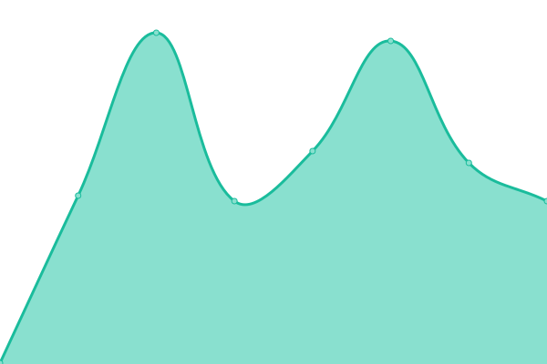
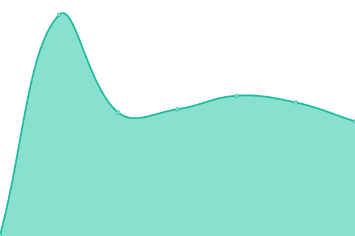

# [📈 Live Status](https://status.loongwork.net): <!--live status--> **🟧 Partial outage**

<!--start: status pages-->
<!-- This summary is generated by Upptime (https://github.com/upptime/upptime) -->
<!-- Do not edit this manually, your changes will be overwritten -->
<!-- prettier-ignore -->
| URL | Status | History | Response Time | Uptime |
| --- | ------ | ------- | ------------- | ------ |
|  [Official Website](https://www.loongwork.net) | 🟩 Up | [official-website.yml](https://github.com/loongwork/status/commits/HEAD/history/official-website.yml) | 

 203ms
     
 | 

<a href="https://status.loongwork.net/history/official-website">100.00%</a>
    

|  Minecraft Main Server | 🟥 Down | [minecraft-main-server.yml](https://github.com/loongwork/status/commits/HEAD/history/minecraft-main-server.yml) | 

 239ms
     
 | 

<a href="https://status.loongwork.net/history/minecraft-main-server">77.80%</a>
    

|  Minecraft Proxy | 🟥 Down | [minecraft-proxy.yml](https://github.com/loongwork/status/commits/HEAD/history/minecraft-proxy.yml) | 

 0ms
     
 | 

<a href="https://status.loongwork.net/history/minecraft-proxy">49.88%</a>
    

<!--end: status pages-->

[**Visit our status website →**](https://status.loongwork.net)

## 📄 License

- Powered by: [Upptime](https://github.com/upptime/upptime)
- Code: [MIT](./LICENSE) © [LoongWork 筑龙](https://www.loongwork.net)
- Data in the `./history` directory: [Open Database License](https://opendatacommons.org/licenses/odbl/1-0/)
